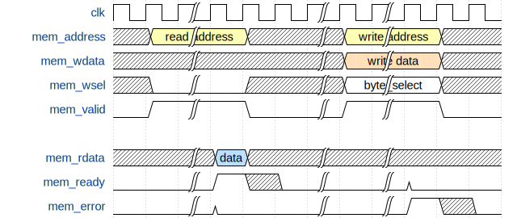

# ALGOL - A RISC-V CPU

Algol is a CPU core that implements the [RISC-V RV32I Instruction Set](http://riscv.org/).

Algol is free and open hardware licensed under the [MIT license](https://en.wikipedia.org/wiki/MIT_License).

**Table of Contents**
<!-- TOC -->

- [ALGOL - A RISC-V CPU](#algol---a-risc-v-cpu)
    - [CPU core details](#cpu-core-details)
    - [Project Details](#project-details)
    - [Directory Layout](#directory-layout)
    - [RISC-V toolchain](#risc-v-toolchain)
    - [Verilog module parameters](#verilog-module-parameters)
    - [Native memory interface](#native-memory-interface)
    - [Simulation](#simulation)
        - [Dependencies for simulation](#dependencies-for-simulation)
        - [Download the compliance tests](#download-the-compliance-tests)
        - [Define `RVGCC_PATH`](#define-rvgcc_path)
        - [Generate the C++ model and compile it](#generate-the-c-model-and-compile-it)
        - [Run the compliance tests](#run-the-compliance-tests)
        - [Simulate execution of a single ELF file](#simulate-execution-of-a-single-elf-file)
            - [Parameters of the C++ model](#parameters-of-the-c-model)
    - [License](#license)

<!-- /TOC -->

## CPU core details

- RISC-V RV32I ISA.
- Machine [privilege mode](https://riscv.org/specifications/privileged-isa/).
  Current version: v1.11.
- Support for external interrupts, as described in the [privilege mode manual](https://riscv.org/specifications/privileged-isa/).
- Multi-cycle datapath, with an average Cycles per Instruction (CPI) of 3.8.
- Single memory port using a native interface.

## Project Details

- Simulation done in C++ using [Verilator](https://www.veripool.org/wiki/verilator).
- [Toolchain](http://riscv.org/software-tools/) using gcc.
- [Validation suit](https://github.com/riscv/riscv-compliance) written in assembly.

## Directory Layout

- `documentation`: LaTeX source files for the CPU manuals (TODO).
- `rtl`: CPU source files written in Verilog.
- `scripts`: Scripts for Formal Verification (FV), installation of tests and zephyr OS.
- `simulator`: verilator testbench, written in C++.
- `soc`: verilog source files for a basic SoC demo (2018 RISC-V softcore contest).
- `software`:
  - `bootloader`: source files for the SoC bootloader.
  - `dhrystone`: benchmark for the core and SoC.
  - `bin2hex.py`: script to convert a bin file to an hex
  - `loader.py`: loader and serial monitor for the SoC.
- `tests`: Assembly test environment for the CPU.
  - `extra_tests`: Aditional test for the software, timer and external interrupt interface.
- `LICENSE`: MIT license.
- `README.md`: This file.

## RISC-V toolchain

The easy way to get the toolchain is to download a prebuilt version from [SiFive](https://www.sifive.com/boards).

The version used to compile the tests is [riscv64-unknown-elf-gcc-8.3.0-2019.08.0](https://static.dev.sifive.com/dev-tools/riscv64-unknown-elf-gcc-8.3.0-2019.08.0-x86_64-linux-ubuntu14.tar.gz)

## Verilog module parameters

The following parameters can be used to configure the cpu core.

- `HART_ID` (default = 0): This sets the ID of the core.
- `RESET_ADDR` (default = 0x80000000): The start address of the program.
- `FAST_SHIFT` (default = 0): Enable the barrel shifter implementation for shift operations.
- `ENABLE_COUNTERS` (default = 0): Add support for the `CYCLE[H]` and
`INSTRET[H]` counters. If set to zero, reading the counters will return an undefined value.

## Native memory interface

The native memory interface is just a simple valid-ready interface, one
transaction at a time.

    output reg [31:0] mem_address
    output reg [31:0] mem_wdata
    output reg [3:0]  mem_wsel
    output reg        mem_valid
    input wire [31:0] mem_rdata
    input wire        mem_ready
    input wire        mem_error

The core initiates a memory transfer by asserting `mem_valid`, and stays high
until the slave asserts `mem_ready` or `mem_error`. Over the `mem_valid` period,
the output signals are stable.

In the following image, two bus transactions requests are issued, one read and
one write. In the read transaction, `mem_wsel` must be zero, and `mem_wdata` is
ignored. In write transaction, `mem_wsel` is not zero, and `mem_rdata` is ignored.

## Simulation
### Dependencies for simulation

- [Verilator](https://www.veripool.org/wiki/verilator). Minimum version: 4.0.
- libelf.
- The official RISC-V [toolchain](https://www.sifive.com/boards).

### Download the compliance tests

To download the [riscv-compliance](https://github.com/riscv/riscv-compliance) repository:

> make install-compliance

This downloads a fork of [riscv-compliance](https://github.com/riscv/riscv-compliance) with added support for this core.

### Define `RVGCC_PATH`
Before running the compliance test suit, benchmarks and extra-tests, define the variable `RVGCC_PATH` to the `bin` folder of the toolchain:

> export RVGCC_PATH=/path/to/bin/folder/

### Generate the C++ model and compile it
To compile the verilator testbench, execute the following command in the root folder of
the project:

> $ make build-core

### Run the compliance tests
To perform the simulation, execute the following command in the root folder of
the project:

> $ make core-sim-compliance-rv32i

### Simulate execution of a single ELF file

To execute a single `.elf` file:

> $ ./build/core.exe --file [ELF file] --timeout [max time] --signature [signature file] --trace

#### Parameters of the C++ model

- `file`: RISC-V ELF file to execute.
- `timeout (optional)`: Maximum simulation time before aborting.
- `signature (optional)`: Write memory dump to a file. For verification purposes.
- `trace (optional)`: Enable VCD dumps. Writes the output file to `build/trace_core.vcd`.

## License

Copyright (c) 2019 Angel Terrones (<angelterrones@gmail.com>).

Release under the [MIT License](LICENSE).
